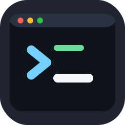
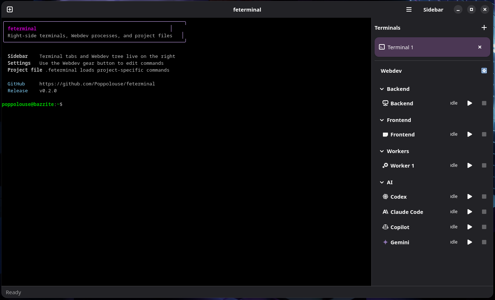

# feterminal

A lightweight GTK4 + VTE terminal application that uses Adwaita styling and lets you change shortcuts either from the UI or from `shortcuts.json`.

<p align="center">
  
</p>

<p align="center">
  
</p>

## Run

```bash
python3 /var/home/poppolouse/Desktop/code/feterminal/feterminal.py
```

You can also point it at a project file directly:

```bash
feterminal /path/to/project/.feterminal
```

## Layout

- Terminal tabs live in the right sidebar instead of the top edge.
- You can open multiple terminal tabs.
- The same sidebar includes an expandable `Webdev` tree.
- The entire right sidebar can be hidden and shown from the header.
- The sidebar opens and closes with a right-edge slide animation.
- Clicking `Webdev` does not replace the main terminal area.
- The command editor opens only from the gear button next to `Webdev`.

## Webdev mode

`Webdev` mode groups commands into separate categories in the right sidebar:

- Backend
- Frontend
- Workers
- AI: Codex, Claude Code, Copilot, Gemini

Each slot can:

- `Start`
- `Stop`
- open its running terminal in the main area

The command editor lives in the collapsible settings panel and includes:

- a multi-line command field
- `Save`
- dynamic worker management

Workers are dynamic, so you can add more than one worker slot from the UI. Commands are stored in [webdev.json](/var/home/poppolouse/Desktop/code/feterminal/webdev.json).

AI entries use brand icons bundled under [brand-icons](/var/home/poppolouse/Desktop/code/feterminal/assets/brand-icons).

## File association

`feterminal` registers the `.feterminal` extension as `application/x-feterminal-project`, so project files can be opened directly from the desktop environment.

## Default shortcuts

- `Ctrl+C`: copy
- `Ctrl+V`: paste text
- `Ctrl+Shift+C`: send `Ctrl+C` to the active process
- `Ctrl+Shift+V`: save the clipboard image as a PNG under `/tmp` and paste its path
- `Ctrl+Shift+T`: open a new terminal tab
- `Ctrl+Shift+R`: reset the terminal
- `F5`: reload `shortcuts.json`
- `Ctrl+,`: open preferences
- `Ctrl+Shift+Q`: close the window

## Changing shortcuts

You can open `Preferences` from the app menu or press `Ctrl+,`. You can also edit `/var/home/poppolouse/Desktop/code/feterminal/shortcuts.json` manually. Example:

```json
{
  "copy": ["<Ctrl>c"],
  "send_interrupt": ["<Ctrl><Shift>c"],
  "paste": ["<Ctrl>v"],
  "paste_image": ["<Ctrl><Shift>v"],
  "open_preferences": ["<Ctrl>comma"]
}
```

Note: terminals do not have a universal standard for pasting images directly into the session. This app handles `Ctrl+Shift+V` by converting the image into a file and inserting the file path into the command line.

## Project files

If a directory contains a `.feterminal` file, feterminal loads it automatically when started from that project. You can also pass the file path explicitly as an argument.

Project behavior:

- the window title becomes `feterminal - <project name>`
- webdev commands are loaded from the project file
- terminal tabs start in the project directory
- AI sessions also start in the project directory
- services can define multiple commands and they run in order

Example `.feterminal`:

```json
{
  "name": "My App",
  "backend": {
    "commands": [
      "uv sync",
      "uv run python manage.py runserver"
    ]
  },
  "frontend": {
    "commands": [
      "pnpm install",
      "pnpm dev"
    ]
  },
  "workers": [
    {
      "id": "worker-1",
      "name": "Queue Worker",
      "commands": [
        "uv run rq worker"
      ]
    }
  ],
  "ai": {
    "codex": {
      "commands": [
        "codex"
      ]
    },
    "claude_code": {
      "commands": [
        "claude"
      ]
    },
    "copilot": {
      "commands": [
        "github-copilot-cli"
      ]
    },
    "gemini": {
      "commands": [
        "gemini"
      ]
    }
  }
}
```

## Desktop entry

Application file:

- `/var/home/poppolouse/Desktop/code/feterminal/io.poppolouse.feterminal.desktop`
