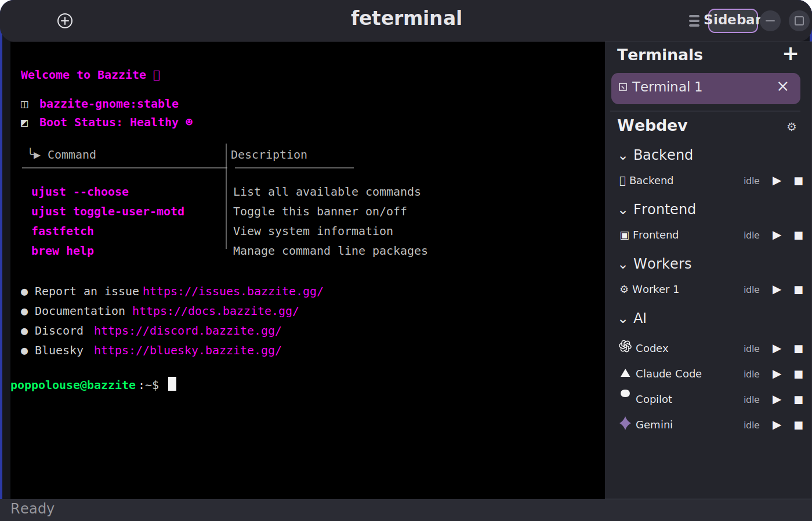

# feterminal

A lightweight GTK4 + VTE terminal application that uses Adwaita styling and lets you change shortcuts either from the UI or from `shortcuts.json`.

<p align="center">
  
</p>

<p align="center">
  
</p>

## Run

```bash
python3 /var/home/poppolouse/feterminal/feterminal.py
```

## Default shortcuts

- `Ctrl+C`: copy
- `Ctrl+V`: paste text
- `Ctrl+Shift+C`: send `Ctrl+C` to the active process
- `Ctrl+Shift+V`: save the clipboard image as a PNG under `/tmp` and paste its path
- `Ctrl+Shift+R`: reset the terminal
- `F5`: reload `shortcuts.json`
- `Ctrl+,`: open preferences
- `Ctrl+Shift+Q`: close the window

## Changing shortcuts

You can open `Preferences` from the app menu or press `Ctrl+,`. You can also edit `/var/home/poppolouse/feterminal/shortcuts.json` manually. Example:

```json
{
  "copy": ["<Ctrl>c"],
  "send_interrupt": ["<Ctrl><Shift>c"],
  "paste": ["<Ctrl>v"],
  "paste_image": ["<Ctrl><Shift>v"],
  "open_preferences": ["<Ctrl>comma"]
}
```

Note: terminals do not have a universal standard for pasting images directly into the session. This app handles `Ctrl+Shift+V` by converting the image into a file and inserting the file path into the command line.

## Desktop entry

Application file:

- `/var/home/poppolouse/feterminal/io.poppolouse.feterminal.desktop`
